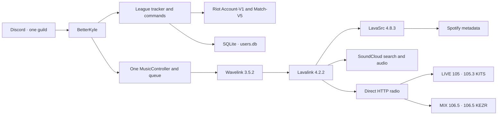

# BetterKyle

BetterKyle is a personal, single-server Discord bot built with `discord.py`. It links Discord users to Riot IDs, announces supported League of Legends matches, preserves match/streak state in SQLite, and provides queued music and live-radio playback through Wavelink and Lavalink.

## League features

- Link Riot accounts by Riot ID (`GameName#TagLine`) and track them by PUUID.
- Poll Match-V5 automatically or on demand with `/refresh`.
- Publish one match announcement for linked party members, with match deduplication, win/loss streak updates, and multi-kill highlights.
- Preserve linked accounts, polling cursors, match history, and streaks in `users.db`.

Match eligibility is a **default-deny queue-ID allowlist** defined only in [`league/queues.py`](league/queues.py):

| Queue ID | Tracked mode | Category |
| ---: | --- | --- |
| `400` | Summoner's Rift — Normal Draft | Standard unranked PvP |
| `420` | Summoner's Rift — Ranked Solo/Duo | Ranked |
| `440` | Summoner's Rift — Ranked Flex | Ranked |
| `450` | ARAM | ARAM |
| `480` | Swiftplay | Swiftplay |

Every other queue ID is rejected, even if Riot reports a Summoner's Rift map or a broad `CLASSIC` game mode. This explicitly excludes ARAM Mayhem, Arena, URF/ARURF, One for All, Nexus Blitz, Ultimate Spellbook, Doom Bots, Clash, TFT, custom/tutorial/Practice Tool/Co-op vs AI games, and rotating, event, experimental, or legacy modes. Retired Normal Blind (`430`) and Quickplay (`490`) are also not accepted. There is no permissive fallback: an unknown or newly introduced queue remains excluded until it is deliberately reviewed and added to the registry.

## Music and radio

BetterKyle has one process-local player and FIFO queue for its one Discord server. It supports:

- Spotify track, album, and playlist URLs through LavaSrc metadata.
- SoundCloud track and playlist/set URLs.
- Plain-text SoundCloud search.
- Automatic playback, ordered playlist insertion, queue display, remove, clear, shuffle, skip, pause/resume, and volume from 0–200%.
- A configurable idle disconnect (300 seconds by default).
- Direct HTTP/HTTPS live-radio streams through Lavalink.

Spotify audio is **not** scraped or played directly. BetterKyle first loads Spotify metadata through LavaSrc, then asynchronously resolves each item to playable SoundCloud audio before it enters playback. Unresolved items are skipped while the remaining album or playlist continues, and Discord receives the added/failed counts.

The source-controlled station registry is [`music/radio_stations.py`](music/radio_stations.py). It currently includes:

| Key | Station | Stream |
| --- | --- | --- |
| `live105` | LIVE 105 · 105.3 KITS | AAC live HTTP stream |
| `mix1065` | MIX 106.5 · 106.5 KEZR | AAC live HTTP stream |

The direct station URLs are kept in the registry rather than `.env`. Starting radio replaces current music, clears the upcoming queue, and uses the same voice player. `/play` exits radio mode and returns to normal queued music. Add another station by adding one entry to `RADIO_STATIONS`; no database or new command is required.

> The checked-in YAML and radio URLs were validated as direct AAC streams. The
> LIVE 105 URL was also validated with a local Lavalink 4.2.2 process, which
> resolved it as a non-seekable ADTS live stream. Live
> Discord voice playback was not exercised end to end, and Spotify/SoundCloud
> playback still requires manual verification in the configured voice channel.

## Architecture



League startup is independent of Lavalink: if the node or its music credentials are unavailable, BetterKyle logs that music is unavailable and continues running League commands and polling.

## Commands

Commands are registered only in the guild configured by `GUILD_ID`.

### League

| Command | Purpose |
| --- | --- |
| `/riot link riot_id:<GameName#TagLine>` | Link or update your Riot account. |
| `/unlink` | Unlink your Riot account without deleting global match history. |
| `/refresh` | Check linked accounts now; each user has a 120-second cooldown. |

### Music and radio

| Command | Purpose |
| --- | --- |
| `/play query:<text-or-url>` | Play or enqueue a SoundCloud search/URL or Spotify URL. |
| `/radio station:<choice>` | Replace music with LIVE 105 or MIX 106.5; `live105` is the default choice. |
| `/pause` / `/resume` | Pause or resume the active music or stream. |
| `/skip` | Skip normal music; live radio correctly reports that it has no next track. |
| `/stop` | Stop playback, clear the queue/radio state, and remain in voice. |
| `/queue` | Show the current item and up to ten upcoming tracks. |
| `/nowplaying` | Show music progress/source/requester or live-radio status. |
| `/shuffle` | Shuffle upcoming normal music. |
| `/volume level:<0-200>` | Set and remember the player volume for this process. |
| `/clearqueue` | Clear upcoming normal music. |
| `/remove position:<1-based-index>` | Remove one upcoming item. |
| `/disconnect` | Stop, clear state, and leave voice. |

## Local development

Prerequisites:

- Python 3.12 is the recommended deployment/runtime target (Wavelink requires
  Python 3.10 or newer; this local fork was also import-tested on Python 3.14).
- Java 17 or newer for Lavalink 4.2.2.
- A Lavalink 4.2.2 JAR placed at `lavalink/Lavalink.jar` (the JAR is intentionally ignored by Git).
- Discord bot, Riot API, and—when testing Spotify—Spotify application credentials.

Create the Python environment and local configuration:

```bash
python3 -m venv .venv
source .venv/bin/activate
python -m pip install -r requirements.txt
cp .env.example .env
```

For the same lint command used during development, install the single optional
tool and run it from the repository root:

```bash
python -m pip install -r requirements-dev.txt
ruff check .
```

Fill in `.env`. To exercise music locally, start Lavalink from its configuration directory so it finds [`lavalink/application.yml`](lavalink/application.yml):

```bash
set -a
source .env
set +a
cd lavalink
java -jar Lavalink.jar
```

Then, from the repository root in a second terminal:

```bash
source .venv/bin/activate
python bot.py
```

Lavalink is configured with SoundCloud and direct HTTP sources enabled, plus LavaSrc 4.8.3 for Spotify metadata. You can run League-only development without a working Lavalink node; music commands will report that playback is unavailable.

## Configuration

`.env` is for secrets and machine-specific deployment values. Copy [`.env.example`](.env.example) and set:

| Variable | Required for | Notes |
| --- | --- | --- |
| `DISCORD_TOKEN` | Bot and League | Discord bot token. |
| `GUILD_ID` | Bot and League | The one Discord server where commands are registered. |
| `CHANNEL_ID` | League | Channel used for match announcements. |
| `RIOT_API_KEY` | League | Riot development/production API key. |
| `LAVALINK_URI` | Music | Machine-specific node URI; defaults to `http://127.0.0.1:2333`. |
| `LAVALINK_PASSWORD` | Music | Shared Wavelink/Lavalink node password. |
| `SPOTIFY_CLIENT_ID` | Spotify | Expanded by `lavalink/application.yml`. |
| `SPOTIFY_CLIENT_SECRET` | Spotify | Expanded by `lavalink/application.yml`. |

Stable, non-secret application policy stays in source control:

- Supported Riot queues: [`league/queues.py`](league/queues.py)
- Radio stations and public stream URLs: [`music/radio_stations.py`](music/radio_stations.py)
- Polling, cooldown, queue, volume, and idle defaults: [`config.py`](config.py)
- Lavalink/LavaSrc source configuration: [`lavalink/application.yml`](lavalink/application.yml)

Riot queue IDs and the LIVE 105 URL are not environment variables. Never commit `.env`, `users.db`, Spotify secrets, Discord/Riot credentials, or `Lavalink.jar`.

## Deployment

Do not deploy this local fork over the existing Ubuntu bot without backups. The safe migration order, Java/Lavalink installation, systemd examples, verification checklist, and rollback procedure are in [`DEPLOYMENT.md`](DEPLOYMENT.md).
